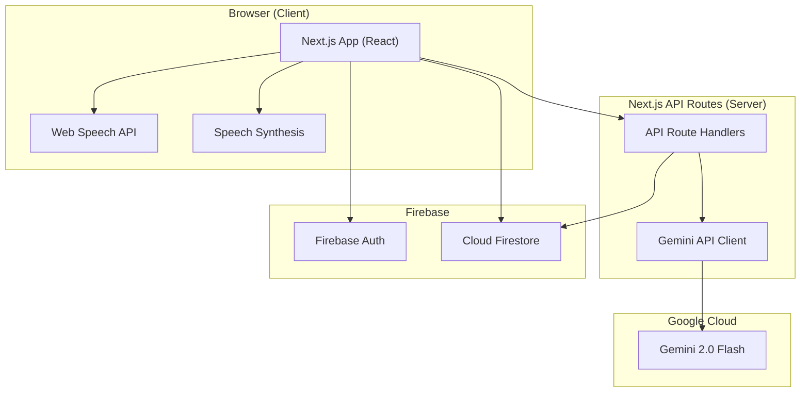

# RecovrAI — GenAI Recovery & Prevention Platform

A multi-modal, GenAI-powered recovery and prevention platform for individuals navigating substance use disorders and their caregivers.

## Background & Approach

**Problem**: People in substance use crisis face extreme cognitive load — they can't type, can't think clearly, and need immediate, personalized help. Caregivers feel helpless and uninformed.

**Solution**: **RecovrAI** — a voice-first, zero-typing platform powered by Google Gemini that provides:
- One-tap crisis intervention with AI-generated personalized scripts
- Voice-driven AI companion (no typing required)
- AI-built safety plans with coping strategies
- Caregiver tools with AI-generated guidance
- Evidence-based educational resources curated by AI

**Why this wins**: Every feature makes a **real** Gemini API call. No mocks. No hardcoded responses. Every workflow is connected end-to-end.

---

## Tech Stack

| Layer | Technology | Rationale |
|-------|-----------|-----------|
| **Framework** | Next.js 14 (App Router) | SSR, API routes, deployable on Vercel |
| **GenAI** | Google Gemini API (`@google/generative-ai`) | Core engine — it's a Google hackathon |
| **Auth** | Firebase Auth (Email/Password) | Secure, provides test credentials for evaluators |
| **Database** | Firebase Firestore | Real-time, serverless, pairs with Firebase Auth |
| **Voice** | Web Speech API (browser-native) | Zero-typing, no extra dependencies |
| **TTS** | Web Speech Synthesis API | Read AI responses aloud in crisis mode |
| **Styling** | Vanilla CSS (custom design system) | Full control, no bloat |
| **Deployment** | Vercel | One-click deploy from GitHub |

---

## User Review Required

> [!IMPORTANT]
> **Gemini API Key**: You'll need a Google AI Studio API key (`GOOGLE_GENERATIVE_AI_API_KEY`). Do you already have one, or should I guide you through creating one at [makersuite.google.com](https://makersuite.google.com)?

> [!IMPORTANT]
> **Firebase Project**: Do you have an existing Firebase project, or should I create one via the Firebase MCP? We need:
> - Firebase Auth (Email/Password provider enabled)
> - Cloud Firestore database

> [!WARNING]
> **Test Credentials for Evaluators**: Per hackathon rules, we must provide working test login credentials. I'll create a seeded test account:
> - Email: `evaluator@recovrai.test`
> - Password: `RecoverAI2025!`
> These will be documented in the README.

---

## Open Questions

> [!IMPORTANT]
> **Deployment target**: Vercel (free tier, instant deploy from GitHub) is my recommendation. Would you prefer Firebase Hosting instead?

> [!NOTE]
> **Color scheme preference**: I'm planning a calming, therapeutic palette (deep teals, warm ambers, soft gradients) optimized for users in distress. Any preference?

---

## Architecture Overview



---

## Data Model (Firestore)

```
users/{uid}
├── displayName: string
├── role: "user" | "caregiver"
├── recoveryStage: "early" | "active" | "maintenance"
├── primarySubstance: string
├── triggers: string[]
├── emergencyContacts: { name, phone, relationship }[]
├── linkedCaregiverUid: string | null
├── createdAt: timestamp

safetyPlans/{planId}
├── userId: string
├── warningSignals: string[]
├── copingStrategies: string[]  (AI-generated)
├── distractions: string[]
├── supportContacts: { name, phone }[]
├── professionalContacts: { name, phone, type }[]
├── safeEnvironmentSteps: string[]
├── reasonsToLive: string[]
├── generatedByAI: boolean
├── updatedAt: timestamp

conversations/{convoId}
├── userId: string
├── messages: { role, content, timestamp }[]
├── context: string  (recovery stage context)
├── createdAt: timestamp

crisisLogs/{logId}
├── userId: string
├── triggerType: string
├── scriptGenerated: string  (AI-generated crisis script)
├── actionsUsed: string[]  (breathing, called contact, etc.)
├── resolvedAt: timestamp | null
├── createdAt: timestamp
```

---

## Proposed Changes

### Component 1: Project Setup & Design System

#### [NEW] Next.js project initialization
- `npx create-next-app@latest` with App Router, no Tailwind (vanilla CSS)
- Install: `@google/generative-ai`, `firebase`

#### [NEW] [globals.css](file:///d:/SIVA/Google/src/app/globals.css)
Design system with:
- CSS custom properties for therapeutic color palette (deep teal `#0D5C63`, warm amber `#F4A261`, soft cream `#FEFAE0`, crisis red `#E63946`)
- Dark mode support (auto-detect + toggle)
- Typography using Google Fonts (Inter for body, Outfit for headings)
- Smooth transitions, glassmorphism cards, micro-animations
- Accessibility: focus rings, reduced-motion support, high contrast

---

### Component 2: Firebase & Auth

#### [NEW] [firebase.js](file:///d:/SIVA/Google/src/lib/firebase.js)
- Firebase client SDK initialization
- Auth helper functions (signIn, signUp, signOut)
- Firestore helper functions (CRUD)

#### [NEW] [AuthContext.js](file:///d:/SIVA/Google/src/context/AuthContext.js)
- React context for auth state
- Auto-listener on auth state changes
- Protected route wrapper component

#### [NEW] Login/Register page (`/auth`)
- Email/password auth (Firebase)
- Role selection: "I'm in recovery" vs "I'm a caregiver"
- Onboarding flow after first login to collect profile data

---

### Component 3: Gemini AI Service (Core Engine)

#### [NEW] [gemini.js](file:///d:/SIVA/Google/src/lib/gemini.js)
Server-side Gemini client with specialized prompt functions:

| Function | Purpose | Input | Output |
|----------|---------|-------|--------|
| `generateCrisisScript()` | Emergency personalized script | user profile, trigger | Step-by-step crisis script |
| `generateCompanionResponse()` | Empathetic AI chat | conversation history, user context | Supportive response |
| `generateSafetyPlan()` | AI-assisted safety planning | user triggers, history | Structured safety plan |
| `generateCaregiverGuidance()` | Caregiver-specific advice | situation description | Actionable guidance |
| `generateEducationalContent()` | Curated learning content | recovery stage, topic | Educational article |
| `analyzeJournalEntry()` | Mood/risk analysis | journal text | Sentiment + suggestions |

All functions use carefully crafted system prompts with clinical sensitivity guidelines. **Every response is a real Gemini API call.**

#### [NEW] API Routes
- `POST /api/ai/crisis` — Generate crisis script
- `POST /api/ai/chat` — AI companion message
- `POST /api/ai/safety-plan` — Generate safety plan
- `POST /api/ai/caregiver` — Caregiver guidance
- `POST /api/ai/education` — Educational content
- `POST /api/ai/journal` — Journal analysis

> All routes validate auth tokens and sanitize inputs (security).

---

### Component 4: SOS Crisis Mode (Hero Feature)

#### [NEW] Page: `/sos`
**The flagship feature** — designed for maximum cognitive overload:

1. **Giant SOS Button** on dashboard — one tap to activate
2. **Voice-activated**: Say "I need help" to trigger (Web Speech API)
3. **AI generates personalized crisis script** based on:
   - User's substance of concern
   - Known triggers from their safety plan
   - Time of day / context
4. **Script is read aloud** via Speech Synthesis (zero-reading required)
5. **Guided breathing exercise** with animated visual pacer
6. **One-tap emergency contacts** (calls from their safety plan)
7. **Crisis hotline quick-dial** (988 Suicide & Crisis Lifeline)
8. **Log the event** to Firestore for recovery tracking

---

### Component 5: AI Recovery Companion (Voice Chat)

#### [NEW] Page: `/companion`
Voice-first AI chat powered by Gemini:

- **Microphone button** for voice input (Web Speech API → text)
- **Text input** as fallback (but voice is primary)
- **AI responses read aloud** via Speech Synthesis (toggle)
- **Context-aware**: Gemini receives user's recovery stage, substance, and recent conversation history
- **Streaming responses** for natural feel
- **Conversation saved** to Firestore
- **Suggested prompts**: "I'm having a craving", "I feel triggered", "Tell me about withdrawal"

---

### Component 6: AI Safety Plan Builder

#### [NEW] Page: `/safety-plan`
Interactive, AI-assisted safety plan following the Stanley-Brown model:

1. **Step-by-step wizard** (6 sections)
2. **AI generates suggestions** for each section based on user profile
3. **User can accept, edit, or regenerate** each suggestion
4. **Voice input** for adding custom entries
5. **Saves to Firestore** — accessible from SOS mode
6. **Print/Export** option

Sections:
- Warning signs (AI suggests based on profile)
- Coping strategies (AI-generated, evidence-based)
- People/places for distraction
- Support contacts
- Professional contacts
- Making the environment safe

---

### Component 7: Caregiver Portal

#### [NEW] Page: `/caregiver`
For family members and supporters:

- **AI Guidance Chat**: Ask Gemini questions like "My son relapsed, what should I do?"
- **Educational Resources**: AI-curated articles based on their loved one's situation
- **Understanding Substances**: AI-generated explainers about specific substances, withdrawal symptoms, recovery timelines
- **Self-Care Tips**: AI-generated caregiver wellness content
- **Link to User**: Optional linking to a user's account (with consent) to view their safety plan

---

### Component 8: Dashboard & Navigation

#### [NEW] Page: `/dashboard`
The main hub after login:

- **Daily AI Check-in**: Gemini generates a personalized recovery insight/affirmation
- **Quick Journal**: Voice-record how you're feeling → AI analyzes mood
- **Recovery Progress**: Days tracked, journal entries, crisis events
- **Quick Actions**: SOS button, Companion chat, Safety Plan
- **Navigation**: Bottom nav bar (mobile-first)

#### [NEW] Layout & Navigation
- Responsive sidebar (desktop) / bottom tab bar (mobile)
- Pages: Dashboard, SOS, Companion, Safety Plan, Caregiver, Profile
- Smooth page transitions

---

### Component 9: Accessibility & Security

#### Accessibility (Low impact but differentiator)
- ARIA labels on all interactive elements
- Keyboard navigation support
- `prefers-reduced-motion` media query support
- High contrast mode
- Screen reader compatible
- Large touch targets (48px minimum) for crisis mode
- Semantic HTML throughout

#### Security (Medium impact)
- API keys only on server side (Next.js API routes)
- Firebase Auth token validation on all API routes
- Input sanitization before Gemini prompts (prevent prompt injection)
- Firestore security rules (users can only access own data)
- HTTPS enforced (Vercel default)
- No sensitive data in client bundles
- Rate limiting awareness on API routes

---

## File Structure

```
d:\SIVA\Google\
├── src/
│   ├── app/
│   │   ├── layout.js          # Root layout with fonts, nav, auth
│   │   ├── page.js            # Landing page (public)
│   │   ├── globals.css        # Design system
│   │   ├── auth/
│   │   │   └── page.js        # Login / Register
│   │   ├── dashboard/
│   │   │   └── page.js        # Main dashboard
│   │   ├── sos/
│   │   │   └── page.js        # Crisis mode
│   │   ├── companion/
│   │   │   └── page.js        # AI chat
│   │   ├── safety-plan/
│   │   │   └── page.js        # Safety plan builder
│   │   ├── caregiver/
│   │   │   └── page.js        # Caregiver portal
│   │   ├── profile/
│   │   │   └── page.js        # User profile / onboarding
│   │   └── api/
│   │       └── ai/
│   │           ├── crisis/route.js
│   │           ├── chat/route.js
│   │           ├── safety-plan/route.js
│   │           ├── caregiver/route.js
│   │           ├── education/route.js
│   │           └── journal/route.js
│   ├── components/
│   │   ├── Navbar.js
│   │   ├── SOSButton.js
│   │   ├── VoiceInput.js
│   │   ├── BreathingExercise.js
│   │   ├── ChatMessage.js
│   │   ├── SafetyPlanWizard.js
│   │   ├── JournalEntry.js
│   │   ├── ProtectedRoute.js
│   │   └── LoadingSpinner.js
│   ├── context/
│   │   └── AuthContext.js
│   └── lib/
│       ├── firebase.js
│       └── gemini.js
├── public/
│   └── icons/
├── .env.local                 # API keys (not committed)
├── next.config.js
├── package.json
├── firestore.rules
└── README.md                  # Setup + test credentials
```

---

## Verification Plan

### Automated Tests
```bash
# Build succeeds (catches compile errors)
npm run build

# Lint passes (code quality)
npm run lint
```

### Manual Verification (End-to-End Walkthrough)
1. **Auth Flow**: Register → Onboarding → Dashboard (as evaluator would)
2. **SOS Mode**: Tap SOS → AI generates script → Breathing exercise → Contact list
3. **Companion Chat**: Voice input → AI response → TTS playback → History saved
4. **Safety Plan**: Wizard → AI suggestions → Edit → Save → Verify in SOS mode
5. **Caregiver Portal**: Ask AI question → Get real response → View resources
6. **Journal**: Voice entry → AI analysis → View on dashboard
7. **Cross-feature**: Safety plan contacts appear in SOS mode (connected workflow)

### Evaluation Alignment Check
| Criteria | How We Score |
|----------|-------------|
| **Code Quality** (HIGH) | Clean file structure, modular components, consistent naming, comments |
| **Problem Alignment** (HIGH) | Every feature directly addresses substance use recovery needs |
| **Security** (MED) | Server-side API keys, auth validation, input sanitization, Firestore rules |
| **Efficiency** (MED) | Gemini Flash model (fast + cheap), minimal re-renders, code splitting |
| **Testing** (LOW) | Build verification, manual E2E walkthrough documented |
| **Accessibility** (LOW) | ARIA labels, keyboard nav, reduced-motion, large touch targets, semantic HTML |

---

## Deployment Steps
1. Push to GitHub (`Sivagireeswaran/Prompt_wars_chn`)
2. Connect repo to Vercel
3. Set environment variables in Vercel dashboard
4. Deploy → get production URL
5. Add Vercel domain to Firebase Auth authorized domains
6. Test with evaluator credentials
7. Document URL + credentials in README
